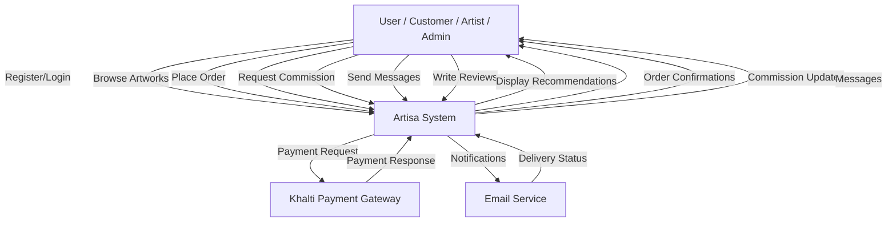
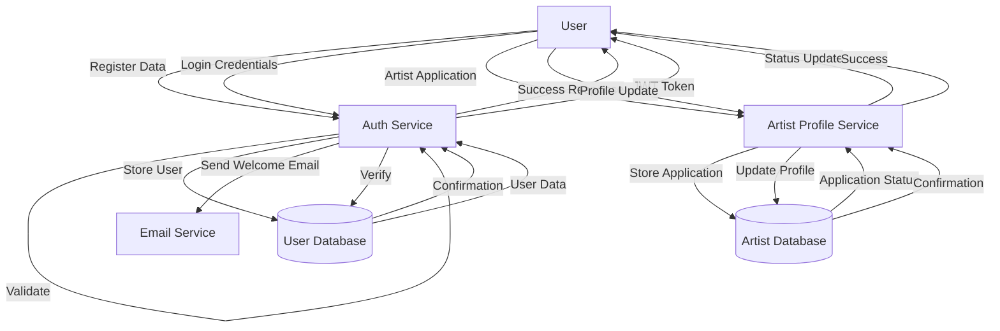
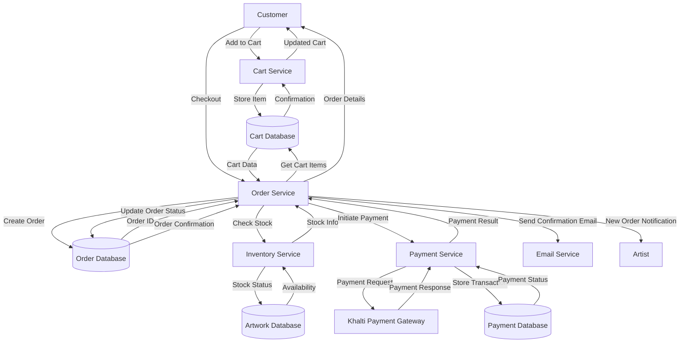
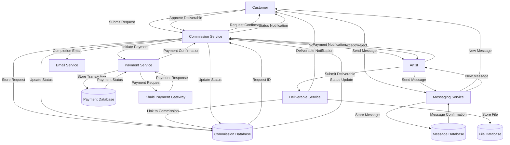
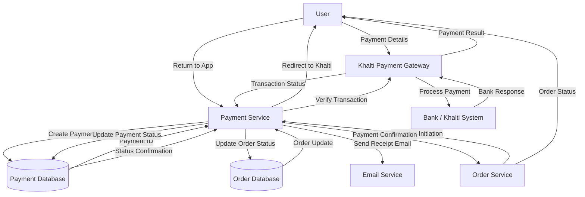
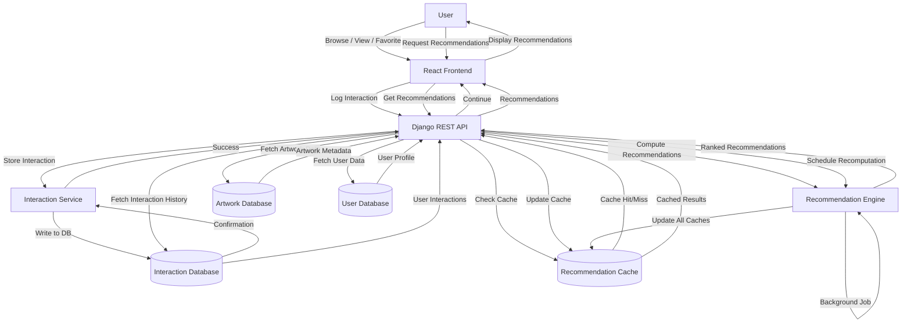

# Data Flow Diagram (DFD)

**Artisa E-Commerce Platform**

---

## Overview

This document describes the data flow through the Artisa platform for key processes: user management, orders, commissions, payments, and recommendations.

---

## Level 0 Context Diagram

---

## Level 1 DFD - User Management

---

## Level 1 DFD - Order Processing

---

## Level 1 DFD - Commission Workflow

---

## Level 1 DFD - Payment Processing

---

## Level 1 DFD - Recommendation System

---

## Data Dictionary

### Data Stores

| Data Store | Description | Key Fields |
|------------|-------------|------------|
| User Database | Stores user accounts, profiles, authentication data | user_id, username, email, role, artist_profile |
| Artist Database | Stores artist profiles, applications, verification data | artist_id, user_id, status, portfolio_samples |
| Cart Database | Stores user shopping cart items | cart_item_id, user_id, artwork_id, quantity |
| Order Database | Stores orders, order items, shipping info | order_id, customer_id, status, total |
| Artwork Database | Stores artworks, categories, tags, images | artwork_id, artist_id, title, price, status |
| Payment Database | Stores payment transactions, Khalti integration | payment_id, transaction_id, amount, status |
| Commission Database | Stores commission requests, deliverables | commission_id, customer_id, artist_id, status |
| Message Database | Stores user-to-user messages | message_id, sender_id, receiver_id, body |
| Interaction Database | Stores user interaction data for recommendations | interaction_id, user_id, target_type, interaction_type |
| Recommendation Cache | Stores pre-computed recommendations | cache_id, user_id, target_ids, computed_at |
| File Database | Stores uploaded files (images, digital files) | file_id, artwork_id, file_path, file_type |

### Data Flows

| Data Flow | Source | Destination | Description |
|-----------|--------|-------------|-------------|
| Register Data | User | Auth Service | User registration information |
| JWT Token | Auth Service | User | Authentication token |
| Cart Data | Cart Database | Order Service | Items to be purchased |
| Payment Request | Payment Service | Khalti | Initiate payment transaction |
| Payment Response | Khalti | Payment Service | Payment completion status |
| Order Confirmation | Order Service | User | Order details and status |
| Commission Request | Customer | Commission Service | New commission request details |
| Deliverable File | Artist | Deliverable Service | Commission deliverable file |
| Recommendation Data | Recommendation Engine | API | Ranked list of recommended items |
| Interaction Log | Frontend | Interaction Service | User activity for recommendations |

---

## Process Descriptions

### User Management Process
1. User submits registration data
2. Auth service validates input
3. User stored in database
4. Welcome email sent
5. JWT token generated and returned
6. For artist application: profile created, stored, status tracked

### Order Processing Process
1. User adds items to cart
2. Cart service stores items
3. User initiates checkout
4. Order service validates stock
5. Order created in database
6. Payment initiated with Khalti
7. Payment processed and verified
8. Order status updated
9. Confirmation email sent
10. Artist notified of new order

### Commission Workflow Process
1. Customer submits commission request
2. Commission stored in database
3. Artist notified of request
4. Artist accepts/rejects commission
5. Messaging enabled between parties
6. Artist submits deliverables
7. Customer reviews and approves
8. Payment processed
9. Commission marked complete
10. Artist paid

### Payment Processing Process
1. Order service initiates payment
2. Payment record created
3. User redirected to Khalti
4. User completes payment
5. Khalti processes with bank
6. Payment result returned
7. Transaction verified
8. Payment status updated
9. Order status updated
10. Receipt email sent

### Recommendation Process
1. User interacts with platform (view, favorite, purchase)
2. Interaction logged to database
3. User requests recommendations
4. System checks cache
5. If cache miss: fetch user data, interactions, artwork data
6. Compute CBF scores (content-based)
7. Compute CF scores (collaborative filtering)
8. Merge scores with hybrid algorithm
9. Update cache with results
10. Return recommendations to user
11. Background job periodically recomputes for all users

---

## Security Considerations

### Data Flow Security
- All API calls authenticated via JWT
- Sensitive data encrypted in transit (HTTPS)
- Payment data handled by Khalti (PCI compliance)
- User passwords hashed before storage
- File uploads validated for type and size

### Access Control
- Role-based access control (RBAC)
- Artist-specific data protected
- Admin-only access to verification documents
- Customer data isolation
- Commission privacy between parties

---

## Performance Considerations

### Caching Strategy
- Recommendation cache pre-computed
- Artwork data cached for marketplace
- User session data cached
- Static assets CDN cached

### Database Optimization
- Indexes on frequently queried fields
- Connection pooling
- Query optimization for recommendations
- Separate read replicas for heavy read operations

### Background Processing
- Recommendation computation as background job
- Email sending via queue
- File processing (thumbnails) async
- Payment verification async

---

## Error Handling

### Data Flow Errors
- Payment failures: retry logic, user notification
- Stock shortages: real-time validation, user notification
- API failures: graceful degradation, error logging
- Cache failures: fallback to database computation
- File upload failures: validation, user feedback

### Recovery Mechanisms
- Transaction rollback on payment failure
- Order status reconciliation
- Interaction data replay for recommendations
- Message delivery confirmation
- Email retry on failure
