# Entity Relationship Diagram (ERD)

**Artisa E-Commerce Platform**

---

## Overview

This document describes the database schema for the Artisa platform, including all entities, relationships, and key fields.

---

## Entity Relationship Diagram

```mermaid
erDiagram
    %% Users & Authentication
    User ||--o| ArtistProfile : "has (optional)"
    User ||--o| ArtistApplication : "submits"
    User ||--o| Favorite : "creates"
    User ||--o| CartItem : "adds"
    User ||--o| Order : "places"
    User ||--o| ShippingAddress : "has"
    User ||--o| Commission : "requests"
    User ||--o| Commission : "accepts (as artist)"
    User ||--o| Message : "sends"
    User ||--o| Message : "receives"
    User ||--o| Review : "writes"
    User ||--o| UserInteraction : "generates"
    User ||--o| RecommendationCache : "has"

    %% Artist Profile & Application
    ArtistProfile ||--o| Artwork : "owns"
    ArtistApplication }o--|| User : "submitted by"
    ArtistApplication }o--|| User : "reviewed by"

    %% Artworks & Categories
    Artwork ||--o| ArtworkImage : "has"
    Artwork ||--o| ArtworkTag : "tagged with"
    Artwork ||--o| DigitalFile : "has (if digital)"
    Artwork }o--|| Category : "belongs to"
    Artwork }o--|| User : "created by"
    Artwork ||--o| Favorite : "favorited in"
    Artwork ||--o| CartItem : "in cart"
    Artwork ||--o| OrderItem : "ordered in"
    Artwork ||--o| Review : "reviewed in"

    %% Categories
    Category ||--o| Category : "parent of"
    Category ||--o| Artwork : "contains"

    %% Orders & Payments
    Order ||--o| OrderItem : "contains"
    Order }o--|| User : "placed by"
    Order ||--o| Payment : "paid via"
    OrderItem }o--|| Artwork : "for"
    OrderItem }o--|| User : "artist"
    OrderItem ||--o| OrderShipment : "shipped via"
    OrderItem ||--o| Review : "reviewed"

    %% Commissions
    Commission ||--o| CommissionDeliverable : "has"
    Commission ||--o| Message : "discussed in"
    Commission }o--|| User : "requested by"
    Commission }o--|| User : "assigned to"

    %% Messages
    Message }o--|| User : "from"
    Message }o--|| User : "to"
    Message }o--o| Commission : "about (optional)"

    %% Reviews
    Review }o--|| User : "by"
    Review }o--|| OrderItem : "for"
    Review }o--|| Artwork : "for artwork"
    Review }o--|| User : "for artist"

    %% Interactions & Recommendations
    UserInteraction }o--|| User : "by"
    RecommendationCache }o--|| User : "for"
```

---

## Entity Definitions

### Users & Authentication

#### User
- **id** (PK, UUID)
- **username** (VARCHAR, unique)
- **email** (VARCHAR, unique)
- **password** (VARCHAR, hashed)
- **first_name** (VARCHAR)
- **last_name** (VARCHAR)
- **role** (ENUM: customer, admin)
- **avatar** (VARCHAR, nullable)
- **is_active** (BOOLEAN, default: true)
- **is_staff** (BOOLEAN, default: false)
- **is_superuser** (BOOLEAN, default: false)
- **created_at** (TIMESTAMP)
- **updated_at** (TIMESTAMP)

#### ArtistProfile
- **id** (PK, UUID)
- **user_id** (FK → User.id, unique)
- **bio** (TEXT, nullable)
- **cover_image** (VARCHAR, nullable)
- **social_links** (JSON, nullable)
- **status** (ENUM: pending, approved, rejected, none)
- **verified_badge** (BOOLEAN, default: false)
- **created_at** (TIMESTAMP)
- **updated_at** (TIMESTAMP)

#### ArtistApplication
- **id** (PK, UUID)
- **user_id** (FK → User.id)
- **portfolio_samples** (JSON)
- **verification_document** (VARCHAR, nullable, admin-only)
- **reason** (TEXT)
- **status** (ENUM: pending, approved, rejected)
- **rejection_reason** (TEXT, nullable)
- **reviewed_by** (FK → User.id, nullable)
- **reviewed_at** (TIMESTAMP, nullable)
- **created_at** (TIMESTAMP)
- **updated_at** (TIMESTAMP)

---

### Artworks & Categories

#### Category
- **id** (PK, UUID)
- **name** (VARCHAR)
- **slug** (VARCHAR, unique)
- **parent_id** (FK → Category.id, nullable)
- **description** (TEXT, nullable)
- **created_at** (TIMESTAMP)
- **updated_at** (TIMESTAMP)

#### Artwork
- **id** (PK, UUID)
- **artist_id** (FK → User.id)
- **title** (VARCHAR)
- **description** (TEXT)
- **price** (DECIMAL, NPR)
- **type** (ENUM: physical, digital)
- **category_id** (FK → Category.id)
- **stock** (INTEGER, default: 1 for physical, null for digital)
- **status** (ENUM: draft, pending_review, published, removed)
- **originality_confirmed** (BOOLEAN, default: false)
- **created_at** (TIMESTAMP)
- **updated_at** (TIMESTAMP)

#### ArtworkImage
- **id** (PK, UUID)
- **artwork_id** (FK → Artwork.id)
- **image** (VARCHAR)
- **thumbnail** (VARCHAR)
- **is_primary** (BOOLEAN, default: false)
- **created_at** (TIMESTAMP)

#### ArtworkTag
- **id** (PK, UUID)
- **artwork_id** (FK → Artwork.id)
- **tag** (VARCHAR)
- **created_at** (TIMESTAMP)

#### DigitalFile
- **id** (PK, UUID)
- **artwork_id** (FK → Artwork.id, unique)
- **file** (VARCHAR)
- **preview_image** (VARCHAR)
- **download_count** (INTEGER, default: 0)
- **created_at** (TIMESTAMP)

---

### Orders & Payments

#### CartItem
- **id** (PK, UUID)
- **user_id** (FK → User.id)
- **artwork_id** (FK → Artwork.id)
- **quantity** (INTEGER, default: 1)
- **created_at** (TIMESTAMP)
- **updated_at** (TIMESTAMP)

#### Order
- **id** (PK, UUID)
- **customer_id** (FK → User.id)
- **subtotal** (DECIMAL)
- **shipping_cost** (DECIMAL)
- **total** (DECIMAL)
- **status** (ENUM: pending, processing, shipped, delivered, cancelled)
- **payment_status** (ENUM: pending, paid, failed, refunded)
- **created_at** (TIMESTAMP)
- **updated_at** (TIMESTAMP)

#### OrderItem
- **id** (PK, UUID)
- **order_id** (FK → Order.id)
- **artwork_id** (FK → Artwork.id)
- **artist_id** (FK → User.id)
- **price** (DECIMAL)
- **quantity** (INTEGER)
- **created_at** (TIMESTAMP)

#### ShippingAddress
- **id** (PK, UUID)
- **user_id** (FK → User.id)
- **province** (VARCHAR)
- **district** (VARCHAR)
- **city** (VARCHAR)
- **street** (VARCHAR)
- **phone** (VARCHAR)
- **is_default** (BOOLEAN, default: false)
- **created_at** (TIMESTAMP)
- **updated_at** (TIMESTAMP)

#### OrderShipment
- **id** (PK, UUID)
- **order_item_id** (FK → OrderItem.id)
- **tracking_number** (VARCHAR)
- **status** (ENUM: pending, shipped, delivered, returned)
- **shipped_at** (TIMESTAMP, nullable)
- **delivered_at** (TIMESTAMP, nullable)
- **created_at** (TIMESTAMP)
- **updated_at** (TIMESTAMP)

#### Payment
- **id** (PK, UUID)
- **payable_type** (VARCHAR: order, commission)
- **payable_id** (UUID)
- **khalti_transaction_id** (VARCHAR)
- **amount** (DECIMAL)
- **status** (ENUM: pending, completed, failed, refunded)
- **created_at** (TIMESTAMP)
- **updated_at** (TIMESTAMP)

---

### Commissions

#### Commission
- **id** (PK, UUID)
- **customer_id** (FK → User.id)
- **artist_id** (FK → User.id)
- **title** (VARCHAR)
- **description** (TEXT)
- **budget** (DECIMAL)
- **deadline** (DATE)
- **status** (ENUM: pending, accepted, in_progress, completed, cancelled)
- **revision_limit** (INTEGER, default: 3)
- **current_revision** (INTEGER, default: 0)
- **created_at** (TIMESTAMP)
- **updated_at** (TIMESTAMP)

#### CommissionDeliverable
- **id** (PK, UUID)
- **commission_id** (FK → Commission.id)
- **file** (VARCHAR)
- **notes** (TEXT, nullable)
- **revision_number** (INTEGER)
- **created_at** (TIMESTAMP)

---

### Messaging & Reviews

#### Message
- **id** (PK, UUID)
- **sender_id** (FK → User.id)
- **receiver_id** (FK → User.id)
- **commission_id** (FK → Commission.id, nullable)
- **body** (TEXT)
- **read_at** (TIMESTAMP, nullable)
- **created_at** (TIMESTAMP)

#### Review
- **id** (PK, UUID)
- **reviewer_id** (FK → User.id)
- **order_item_id** (FK → OrderItem.id, unique)
- **artwork_id** (FK → Artwork.id)
- **artist_id** (FK → User.id)
- **rating** (INTEGER, 1-5)
- **comment** (TEXT)
- **created_at** (TIMESTAMP)
- **updated_at** (TIMESTAMP)

---

### Interactions & Recommendations

#### UserInteraction
- **id** (PK, UUID)
- **user_id** (FK → User.id)
- **target_type** (ENUM: artwork, artist)
- **target_id** (UUID)
- **interaction_type** (ENUM: view, favorite, cart_add, purchase, commission, profile_view)
- **weight** (FLOAT, default: 1.0)
- **created_at** (TIMESTAMP)

#### RecommendationCache
- **id** (PK, UUID)
- **user_id** (FK → User.id, unique)
- **target_type** (ENUM: artwork, artist)
- **target_ids** (JSON array of UUIDs)
- **computed_at** (TIMESTAMP)

---

## Key Relationships

### One-to-One (1:1)
- User ↔ ArtistProfile (optional)
- Artwork ↔ DigitalFile (optional, for digital artworks)

### One-to-Many (1:N)
- User → ArtistApplication
- User → Artwork (as artist)
- User → Order (as customer)
- User → Commission (as customer)
- User → Commission (as artist)
- Artist → Artwork
- Category → Artwork
- Category → Category (self-referencing for hierarchy)
- Order → OrderItem
- Commission → CommissionDeliverable

### Many-to-Many (N:M)
- User ↔ Artwork (via CartItem)
- User ↔ Artwork (via Favorite)
- User ↔ User (via Message)
- Artwork ↔ Tag (via ArtworkTag)

---

## Indexes

### Performance Indexes
- `users_username_idx` on User(username)
- `users_email_idx` on User(email)
- `artworks_status_idx` on Artwork(status)
- `artworks_category_idx` on Artwork(category_id)
- `artworks_artist_idx` on Artwork(artist_id)
- `artworks_type_idx` on Artwork(type)
- `orders_customer_idx` on Order(customer_id)
- `orders_status_idx` on Order(status)
- `user_interactions_user_idx` on UserInteraction(user_id)
- `user_interactions_target_idx` on UserInteraction(target_type, target_id)
- `recommendation_cache_user_idx` on RecommendationCache(user_id)

---

## Constraints

### Unique Constraints
- User.username
- User.email
- ArtistProfile.user_id
- Category.slug
- DigitalFile.artwork_id
- Review.order_item_id
- RecommendationCache.user_id

### Foreign Key Constraints
- All relationships defined in ERD
- CASCADE on delete for most relationships
- SET NULL for optional relationships

### Check Constraints
- User.role IN ('customer', 'admin')
- ArtistProfile.status IN ('pending', 'approved', 'rejected', 'none')
- Artwork.status IN ('draft', 'pending_review', 'published', 'removed')
- Artwork.type IN ('physical', 'digital')
- Artwork.stock >= 0 (when not null)
- Order.status IN ('pending', 'processing', 'shipped', 'delivered', 'cancelled')
- Order.payment_status IN ('pending', 'paid', 'failed', 'refunded')
- Commission.status IN ('pending', 'accepted', 'in_progress', 'completed', 'cancelled')
- Review.rating BETWEEN 1 AND 5

---

## Notes

1. **Soft Deletes**: Consider adding `deleted_at` timestamp for soft delete functionality on critical entities
2. **Timestamps**: All tables have `created_at` and `updated_at` for audit trail
3. **JSON Fields**: Used for flexible data (social_links, portfolio_samples, target_ids)
4. **UUID Primary Keys**: All primary keys use UUID for distributed system compatibility
5. **Media Storage**: Image and file paths are stored; actual files in `media/` directory
6. **Multi-vendor**: OrderItem links to artist_id for commission calculations per artist
