# UML Diagrams

**Artisa E-Commerce Platform**

---

## Overview

This document contains UML diagrams for the Artisa platform, including use case diagrams, activity diagrams, and sequence diagrams for key processes.

---

## Use Case Diagram

### System Level Use Case Diagram

```mermaid
useCaseDiagram
    actor "Guest" as Guest
    actor "Customer" as Customer
    actor "Artist" as Artist
    actor "Admin" as Admin
    
    package "Artisa Platform" {
        usecase "Register" as UC1
        usecase "Login" as UC2
        usecase "Browse Artworks" as UC3
        usecase "Search Artworks" as UC4
        usecase "View Artwork Details" as UC5
        usecase "View Artist Profile" as UC6
        usecase "Add to Cart" as UC7
        usecase "Manage Cart" as UC8
        usecase "Place Order" as UC9
        usecase "Track Order" as UC10
        usecase "Request Commission" as UC11
        usecase "Manage Commissions" as UC12
        usecase "Send Messages" as UC13
        usecase "Write Review" as UC14
        usecase "Manage Favorites" as UC15
        usecase "Apply for Artist" as UC16
        usecase "Manage Artworks" as UC17
        usecase "Process Orders" as UC18
        usecase "Verify Artists" as UC19
        usecase "Moderate Content" as UC20
        usecase "View Analytics" as UC21
        usecase "Manage Categories" as UC22
    }
    
    Guest --> UC1
    Guest --> UC2
    Guest --> UC3
    Guest --> UC4
    Guest --> UC5
    Guest --> UC6
    
    Customer --|> Guest
    Customer --> UC7
    Customer --> UC8
    Customer --> UC9
    Customer --> UC10
    Customer --> UC11
    Customer --> UC13
    Customer --> UC14
    Customer --> UC15
    Customer --> UC16
    
    Artist --|> Customer
    Artist --> UC12
    Artist --> UC17
    Artist --> UC18
    
    Admin --> UC19
    Admin --> UC20
    Admin --> UC21
    Admin --> UC22
    Admin --> UC3
    Admin --> UC5
    Admin --> UC6
    
    UC1 ..> UC2 : <<include>>
    UC9 ..> UC7 : <<include>>
    UC9 ..> UC8 : <<include>>
    UC14 ..> UC9 : <<extend>>
    UC12 ..> UC13 : <<include>>
    UC17 ..> UC16 : <<extend>>
```

### Use Case Descriptions

| Use Case | Actor | Description |
|----------|-------|-------------|
| Register | Guest | Create a new user account with email and password |
| Login | Guest | Authenticate with credentials to access platform |
| Browse Artworks | Guest, Customer, Artist, Admin | View marketplace with all published artworks |
| Search Artworks | Guest, Customer, Artist, Admin | Search artworks by title, artist, category |
| View Artwork Details | Guest, Customer, Artist, Admin | View detailed artwork information and images |
| View Artist Profile | Guest, Customer, Artist, Admin | View artist portfolio, bio, and verified status |
| Add to Cart | Customer | Add artwork to shopping cart |
| Manage Cart | Customer | View, update, or remove items from cart |
| Place Order | Customer | Complete purchase with payment |
| Track Order | Customer | View order status and shipping information |
| Request Commission | Customer | Submit custom artwork commission request |
| Manage Commissions | Artist | Accept, reject, and manage commission requests |
| Send Messages | Customer, Artist | Communicate about orders or commissions |
| Write Review | Customer | Review purchased artwork and artist |
| Manage Favorites | Customer | Add/remove artworks from wishlist |
| Apply for Artist | Customer | Submit artist verification application |
| Manage Artworks | Artist | Create, edit, and manage artwork listings |
| Process Orders | Artist | View and fulfill customer orders |
| Verify Artists | Admin | Review and approve/reject artist applications |
| Moderate Content | Admin | Review and moderate artwork submissions |
| View Analytics | Admin | View platform usage and sales analytics |
| Manage Categories | Admin | Create and manage artwork categories |

---

## Activity Diagrams

### Purchase Activity Diagram

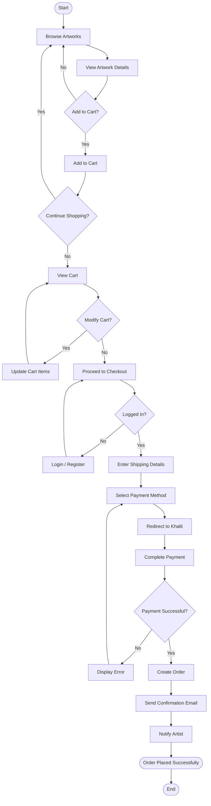

### Commission Activity Diagram

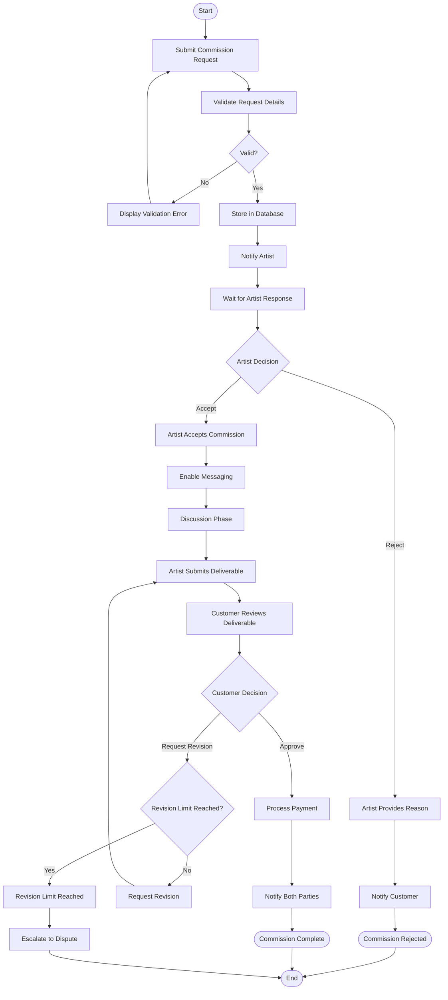

### Artist Verification Activity Diagram

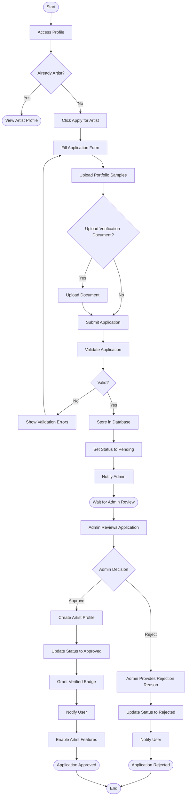

---

## Sequence Diagrams

### Purchase Sequence Diagram

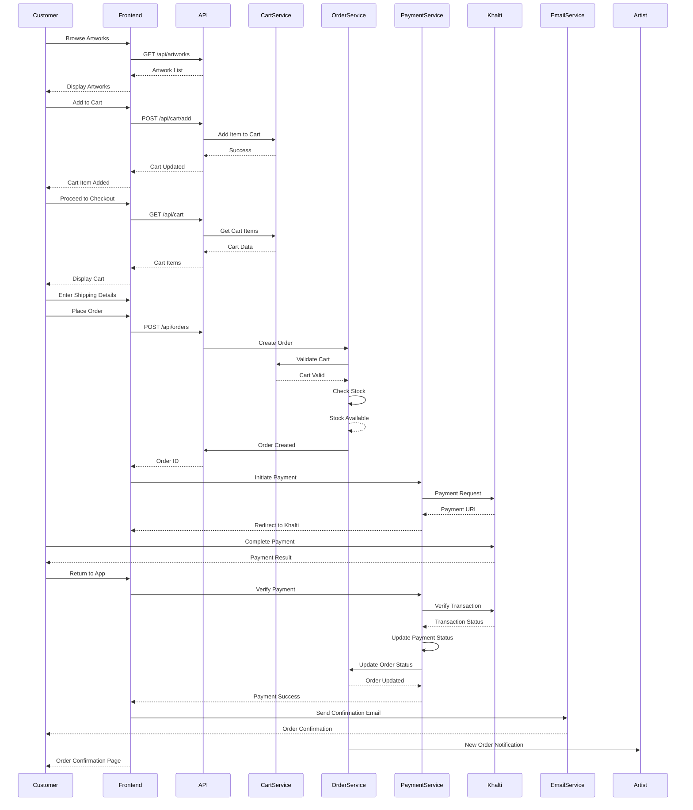

### Commission Sequence Diagram

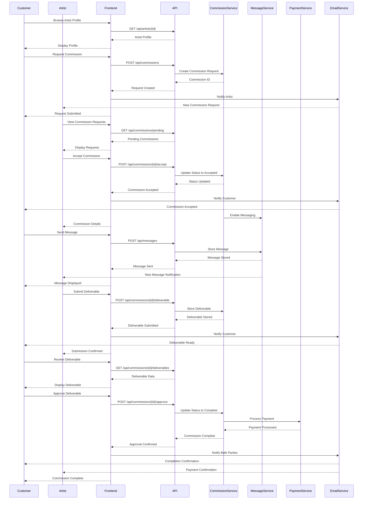

### Authentication Sequence Diagram

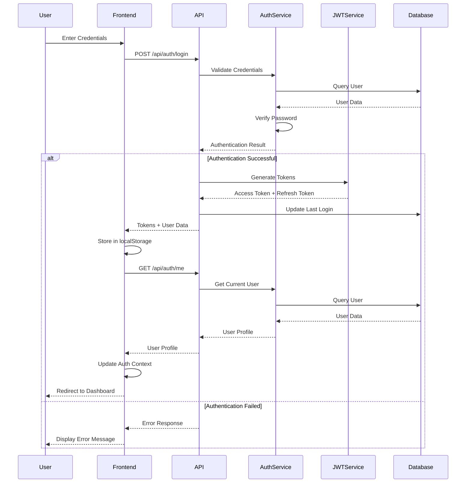

### Recommendation Sequence Diagram

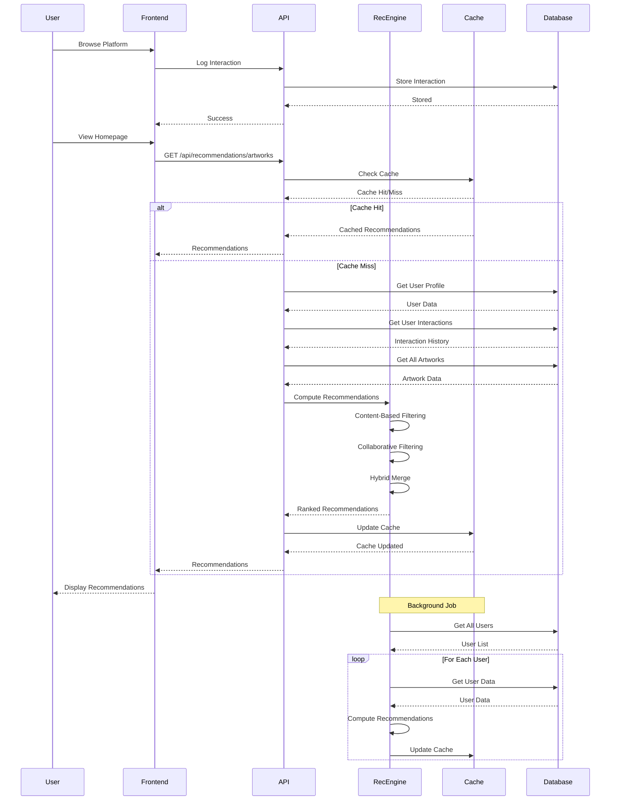

---

## Class Diagram

### Core Classes

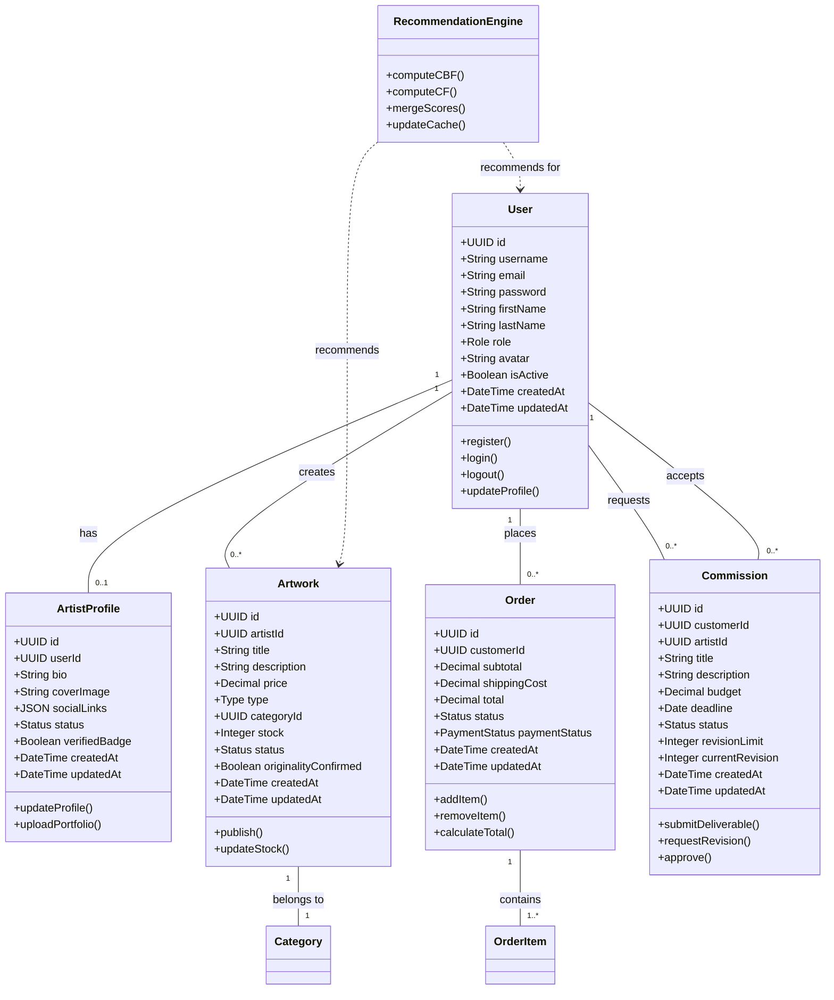

---

## State Diagrams

### Order State Diagram

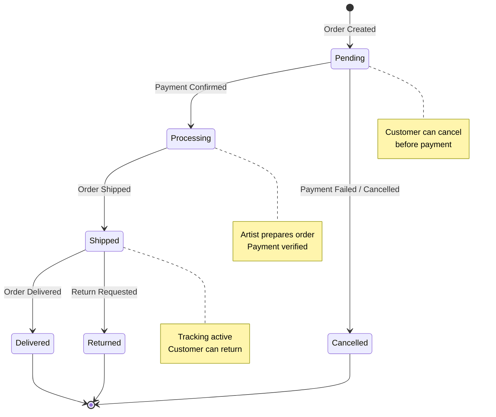

### Commission State Diagram

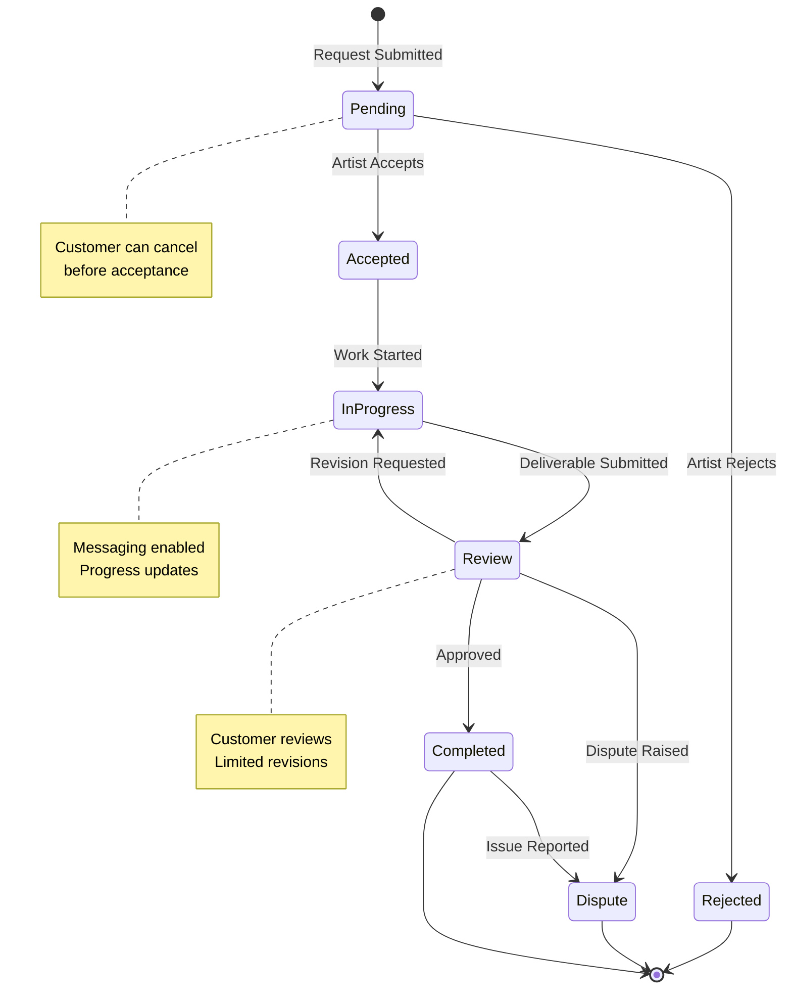

### Artwork State Diagram

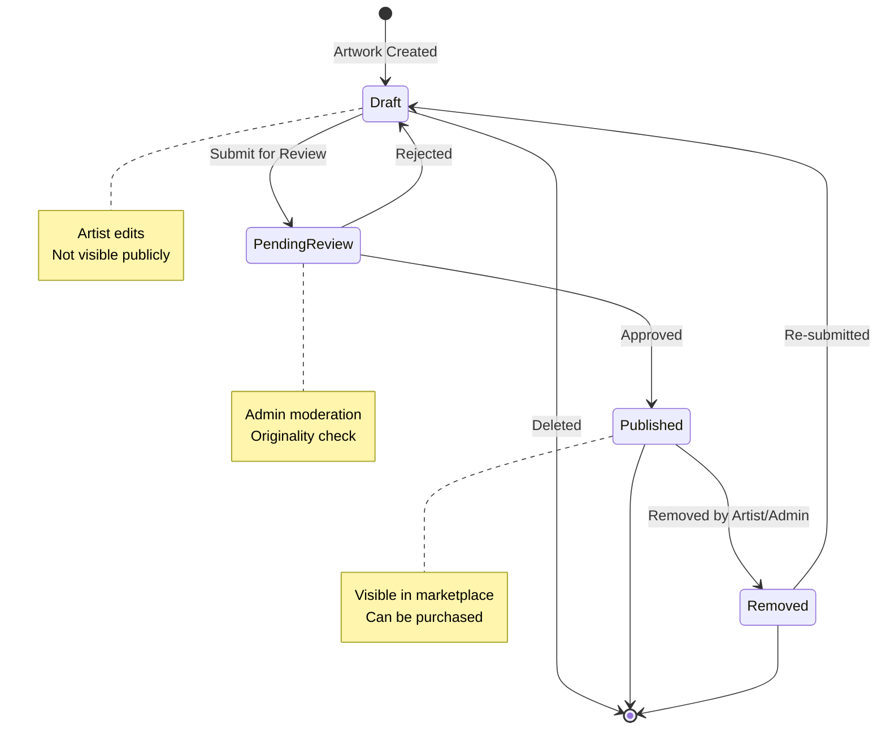

---

## Notes

### Assumptions
1. All users must be authenticated to perform actions except browsing
2. Artists must be verified before listing artworks
3. Payments are processed exclusively through Khalti
4. Recommendations are computed periodically and cached
5. Messages are real-time or near real-time
6. File uploads have size and type restrictions

### Extensions
1. Add more detailed sequence diagrams for error handling
2. Include deployment diagram for system architecture
4. Add component diagram for frontend structure
5. Include package diagram for backend app structure
