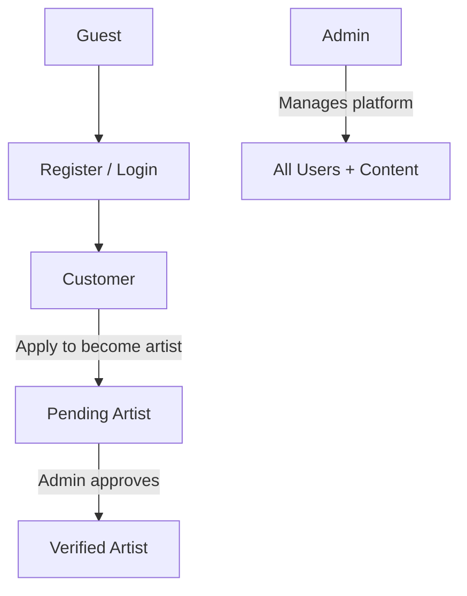
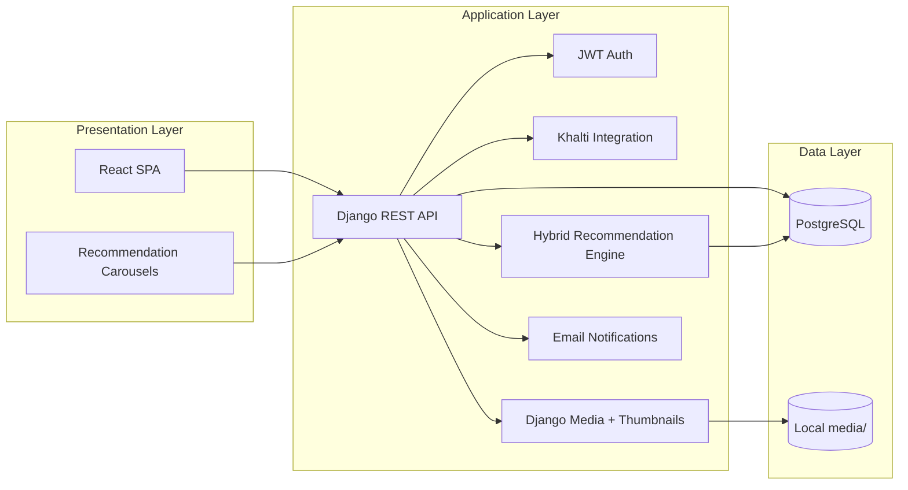

# Artisa Fullstack E-Commerce Plan

> **Artisa** — A multi-vendor e-commerce platform for Nepali artists to showcase portfolios, sell physical and digital artwork, receive commission requests, and connect with customers through personalized hybrid recommendations.

**Last updated:** August 2026  
**Status:** Pre-development — planning complete, implementation not started

---

## Current State

The repo at `artisa/` contains the proposal PDF and an empty UI/UX folder. No application code, git repo, or dependencies exist yet.

---

## Project Vision

Artisa combines three platform types into one:

| Inspiration | What Artisa takes from it |
|---|---|
| Etsy / Daraz | Multi-vendor artwork marketplace, cart, checkout |
| Behance / Instagram | Artist profiles, portfolio showcase |
| Fiverr / Upwork | Commission requests, artist–customer workflow |

### Target users



- **Customer** — browse, buy, commission, message, review; receive personalized recommendations
- **Verified Artist** — portfolio, list artworks, accept commissions, manage orders (artists can also buy as customers)
- **Admin** — verify artists, moderate content, manage categories, view transactions

---

## Tech Stack

| Layer | Choice |
|---|---|
| Frontend | React.js + Tailwind CSS + React Router |
| Backend | Python + Django + Django REST Framework (DRF) |
| Auth | Django custom User model + JWT (`djangorestframework-simplejwt`) + RBAC permissions |
| Database | PostgreSQL |
| Media | Local file storage (`MEDIA_ROOT`) with Pillow thumbnails — cloud storage deferred |
| Recommendations | Hybrid content-based + collaborative filtering (scikit-learn / pandas / numpy) |
| Payments | Khalti Payment Gateway (sandbox for development) |
| Dev tools | Git/GitHub, Postman, Figma, Jira |

### Changes from original proposal PDF

| Area | Original proposal | This plan |
|---|---|---|
| Backend | PHP + Laravel | Python + Django + DRF |
| Auth | Laravel Sanctum | JWT (simplejwt) |
| Database | MySQL | PostgreSQL |
| Media | Cloudinary | Local storage (decide cloud later) |
| Recommendations | Not included | Hybrid CBF + CF engine |
| Dev tools | GitHub, Postman, Figma | Same + Jira |

---

## Role Model (improved)

Use a **dual-role model** instead of switching `user.role` to `artist` on approval:

```
user.role              = customer | admin     (base platform access)
artist_profile.status  = pending | approved | rejected | none
```

- All registered users are **customers** by default and can buy art, commission artists, and favorite items
- Approved artists retain customer capabilities — they can also sell and accept commissions
- Admin is a separate `user.role`
- Permissions check `artist_profile.status == approved` for artist-only actions

---

## Repo Structure

```
artisa/
├── backend/                    # Django project
│   ├── artisa/                 # project settings
│   ├── apps/
│   │   ├── users/              # auth, profiles, artist applications
│   │   ├── artworks/           # artworks, categories, cart, orders
│   │   ├── commissions/        # commission requests + messaging
│   │   ├── payments/           # Khalti integration
│   │   └── recommendations/    # hybrid rec engine + interaction tracking
│   ├── media/                  # local uploads (gitignored)
│   ├── requirements.txt
│   └── manage.py
├── frontend/                   # React SPA (Vite)
│   ├── src/
│   │   ├── components/
│   │   │   └── recommendations/
│   │   ├── pages/
│   │   ├── hooks/
│   │   ├── services/
│   │   └── context/
│   └── tailwind.config.js
├── plan/
│   └── artisa.md               # this file
├── tasks/                      # individual task briefs
├── docs/                       # ERD, DFD, UML, API docs, rec methodology
└── proposal/
```

---

## System Architecture



---

## Trust & Verification (proposal theme)

The proposal emphasizes authenticity in the age of AI-generated art. Build this into the product:

- **Verified Artist badge** on profiles and artwork cards (shown when `artist_profile.status == approved`)
- **Originality declaration** checkbox on artwork upload ("I confirm this is my original human-created work")
- **Artist application** with portfolio samples, optional verification document upload (ID/portfolio proof — admin-only), and verification notes
- **Artwork moderation** before public listing (see lifecycle below)
- Admin rejection reason returned to applicant

---

## Core Database Entities

| Entity | Key fields / notes |
|---|---|
| `users` | name, email, password, **role** (`customer`, `admin`), avatar |
| `artist_profiles` | user_id, bio, social links, cover_image, **status** (`pending`, `approved`, `rejected`) |
| `artist_applications` | user_id, portfolio_samples, verification_document (optional, admin-only), reason, status, rejection_reason, reviewed_by |
| `categories` | name, slug, parent_id |
| `artworks` | artist_id, title, description, price (NPR), type (`physical`, `digital`), category_id, stock, **status** (`draft`, `pending_review`, `published`, `removed`), originality_confirmed |
| `artwork_images` | artwork_id, image (original), thumbnail, is_primary |
| `artwork_tags` | artwork_id, tag |
| `digital_files` | artwork_id, file, preview_image — full file served only after purchase |
| `favorites` | user_id, artwork_id — doubles as **wishlist** |
| `cart_items` | user_id, artwork_id, quantity |
| `orders` | customer_id, subtotal, shipping_cost, total, status, payment_status |
| `order_items` | order_id, artwork_id, artist_id, price, quantity |
| `shipping_addresses` | user_id, province, district, city, street, phone |
| `order_shipments` | order_item_id, tracking_number, status, shipped_at |
| `commissions` | customer_id, artist_id, title, description, budget, deadline, status, revision_limit |
| `commission_deliverables` | commission_id, file, notes, revision_number |
| `messages` | sender_id, receiver_id, commission_id (nullable), body, read_at |
| `reviews` | reviewer_id, order_item_id, artwork_id, artist_id, rating, comment — **purchase-verified only** |
| `payments` | payable_type, payable_id, khalti_transaction_id, amount, status |
| `user_interactions` | user_id, target_type, target_id, interaction_type, weight, created_at |
| `recommendation_cache` | user_id, target_type, target_ids (JSON), computed_at |

### Artwork lifecycle

```
draft → pending_review → published → removed
```

Admin or automated approval moves artwork to `published`. Only published artworks appear in marketplace.

### Key relationships

- User 1:1 ArtistProfile (optional, created on application)
- Artist 1:N Artworks
- Customer N:M Artworks via Cart and Favorites
- Order 1:N OrderItems (multi-vendor: each item tied to an artist)
- Commission 1:N Deliverables; linked Message thread
- Review requires completed OrderItem (one review per purchase)

---

## Hybrid Recommendation System

### What gets recommended

| Target | Where shown | Signals |
|---|---|---|
| Artworks | Homepage carousel, marketplace "For You", artwork detail "Similar works" | Views, favorites, cart adds, purchases |
| Artists | Homepage "Artists you may like", artist profile "Similar artists" | Profile views, commissions, purchases, style overlap |

### Algorithm (semester-scope, phased)

**Phase A — ship first (cold-start safe):**
- Content-based filtering: cosine similarity on tags, category, price band, artwork type
- Popularity/trending fallback for guests and new users

**Phase B — add when interaction data exists:**
- Item-based collaborative filtering from implicit feedback matrix
- Hybrid merge: `final_score = α × CBF + (1 − α) × CF` (start α = 0.6)

**Phase C — evaluation (for university report):**
- Seed realistic interaction data via management command
- Measure Precision@K and Recall@K on seeded test set
- Click-through rate (CTR) in demo scenarios
- Before/after comparison: generic trending vs personalized recommendations
- Demo scenario: user browses category X → recs shift toward category X

### Performance

- Precompute via `python manage.py compute_recommendations`
- Cache results in `recommendation_cache` table
- Rate-limit `POST /api/interactions/` to prevent score manipulation

---

## API Route Groups

```
POST   /api/auth/register, /login, /logout, /refresh, /password-reset/
GET    /api/auth/me
GET    /api/artworks, /api/artworks/{id}
GET    /api/artists/{id}
GET    /api/favorites/                          # wishlist
POST   /api/favorites/{artwork_id}/
GET    /api/recommendations/artworks
GET    /api/recommendations/artists
GET    /api/recommendations/similar/{id}
POST   /api/interactions/
POST   /api/artist/apply
CRUD   /api/artist/artworks
CRUD   /api/cart
POST   /api/orders
GET    /api/orders/{id}/download/{item_id}      # secure digital download
CRUD   /api/commissions
POST   /api/commissions/{id}/deliverables/
GET/POST /api/messages
POST   /api/payments/khalti/initiate, /verify
GET/POST /api/reviews
GET    /api/artist/earnings                       # artist sales summary
Admin  /api/admin/...                             # Django Admin for MVP; custom UI stretch
```

Protect routes with JWT + DRF permission classes (`IsAuthenticated`, `IsApprovedArtist`, `IsAdmin`).

---

## Frontend Page Map

| Area | Pages |
|---|---|
| Public | Home (rec carousel), Marketplace (search/filter + suggested), Artwork Detail (similar works), Artist Profile (verified badge, similar artists) |
| Auth | Login, Register, Password Reset |
| Customer | Cart, Checkout (Nepal address), Order History, Favorites/Wishlist, Commission Request, Messages |
| Artist | Dashboard, Portfolio Editor, Artwork Upload, Commission Inbox, Orders, Earnings |
| Admin | Django Admin (MVP) → custom dashboard (stretch) |

**Localization:** NPR currency formatting (`Rs. 1,500`), Nepal address fields (province, district, city).

---

## MVP Demo Milestone

Minimum shippable demo for university presentation:

```
Tasks 1 → 2 → 4 → 5 → 7 → 8 → 9 → 10 → 11 → 12
```

Delivers: auth, artist verification, artworks, marketplace, cart, checkout, Khalti, Django Admin.

Everything after Task 12 is enhancement (recommendations, commissions, messaging, polish).

---

## Step-by-Step Build Plan

Build **one task at a time**. Task briefs live in [`tasks/`](../tasks/).

### Phase 1 — Foundation (Weeks 1–2)

#### Task 1: Project scaffolding
- Init git repo, `.gitignore`, README
- Django project with DRF, `django-cors-headers`, `psycopg2`, `djangorestframework-simplejwt`, `Pillow`
- React app (Vite + React + Tailwind)
- PostgreSQL connection, CORS, JWT settings, `MEDIA_ROOT`/`MEDIA_URL`
- `.env.example` for both apps
- Health-check API endpoint verified from frontend

#### Task 2: Auth system
- Custom `User` model: `role` = `customer` | `admin` (dual-role model — artists are customers with approved profile)
- Register, login, logout, token refresh, `/api/auth/me`
- Password reset flow (email backend: console in dev)
- Email verification (optional stretch — skip for MVP if time is tight)
- Two-factor authentication (2FA) - optional future enhancement (TOTP/SMS)
- JWT in React auth context; protected routes by role
- DRF permission classes: `IsAdmin`, `IsApprovedArtist`

### Phase 2 — Design (Weeks 3–4)

#### Task 3: Design artifacts
- ERD (all entities above) in `docs/erd.md`
- DFD (user management, orders, commissions, payments, recommendations) in `docs/dfd.md`
- UML: use case, activity (purchase, commission, verification), sequence diagrams
- `docs/recommendations.md` — algorithm, signals, evaluation plan
- Figma wireframes: home, marketplace, artwork detail, artist profile, cart, checkout, dashboards

#### Task 4: Core models + seed data
- Django models for all entities; migrations against PostgreSQL
- Management command `seed_demo_data`: admin user, categories, artists, artworks, tags, sample interactions

### Phase 3 — Artists & Marketplace (Weeks 5–8)

#### Task 5: Artist application + verification + Django Admin
- Application API; admin approves/rejects with reason
- On approval: `artist_profile.status = approved` (user stays `customer` role)
- Register all models in **Django Admin** for verification queue, categories, moderation
- Verified badge data exposed in API

#### Task 6: Artist portfolio + media thumbnails
- Public profile page: bio, cover, artwork grid, verified badge, social links
- Profile editor; avatar/cover upload to `media/`
- Pillow generates thumbnails on upload (thumbnail, display, original sizes)
- Validate file type (magic bytes) and max size

#### Task 7: Artwork CRUD + moderation + originality
- Artist creates artwork: draft → submit for review → published
- Originality declaration required on submit
- Multiple images per artwork; tags; physical stock or digital file
- Admin moderates via Django Admin
- Only `published` artworks in public API

#### Task 8: Marketplace browse
- Grid/list view; search by title and artist name
- Filter: category, price range, type, verified artist
- Sort: newest, price, rating (rating sort uses seed/review data until Task 17 ships)
- NPR price display

#### Task 9: Artwork detail + favorites/wishlist
- Image gallery, artist link, verified badge, add-to-cart, reviews preview
- Favorites toggle (wishlist page)
- Log `view` interaction for authenticated users

### Phase 4 — E-Commerce (Weeks 8–10)

#### Task 10: Shopping cart
- Add/remove/update quantity (physical; digital qty = 1)
- Persisted per user; cart badge in navbar
- Log `cart_add` interactions

#### Task 11: Orders + checkout + shipping
- Nepal address form (province, district, city, street, phone)
- Flat-rate shipping cost on checkout (MVP — per-artist shipping = stretch)
- Create order from cart; multi-vendor order items per artist
- Status flow: `pending` → `paid` → `processing` → `shipped` → `delivered`
- Stock decrement on purchase; out-of-stock prevention
- Artist marks item shipped + tracking number
- Customer order history; artist order management
- Artist earnings summary (sales total + per-order breakdown)
- Log `purchase` interactions on completion

#### Task 12: Khalti payments + secure digital downloads
- Khalti sandbox: initiate + server-side verify (idempotent)
- Document Khalti sandbox setup and test credentials in `docs/khalti.md`
- Update order/commission payment status; `payments` table
- Secure download endpoint: auth + order ownership check + time-limited signed URL
- Separate preview image vs full-resolution digital file

### Phase 5 — Recommendations (Weeks 10–11)

#### Task 13: Interaction tracking
- `user_interactions` model + `POST /api/interactions/`
- Track: views, favorites, cart adds, purchases
- Frontend hooks on detail pages, favorites, cart, checkout
- Rate limiting on endpoint

#### Task 14: Hybrid recommendation engine
- Content-based: TF-IDF / feature-vector cosine similarity
- Collaborative: item-based CF (add when data exists; fallback to CBF + trending)
- Endpoints: `/recommendations/artworks`, `/artists`, `/similar/{id}`
- `compute_recommendations` management command + cache table
- React `RecommendedCarousel` on home, marketplace, artwork detail, artist profile
- Evaluation: Precision@K, Recall@K documented in `docs/recommendations.md`

### Phase 6 — Commissions & Social (Weeks 11–13)

#### Task 15: Commission flow + deliverables
- Customer submits commission (title, brief, budget NPR, deadline, reference images)
- Artist accept/decline
- Status: `requested` → `accepted` → `in_progress` → `delivered` → `completed` / `cancelled`
- Artist uploads deliverables; customer approves or requests revision (limit: 2)
- Optional Khalti deposit on acceptance
- Commission packages (Basic/Standard/Premium tiers) = stretch — simple single-request flow is MVP

#### Task 16: In-app messaging
- Commission-linked message threads (MVP scope)
- General artist–customer inquiry outside commissions = stretch (defer if time is tight)
- Polling for new messages (WebSockets = stretch)
- Unread indicators

#### Task 17: Purchase-verified reviews
- Review only after order item `delivered`
- One review per order item
- Average rating on artwork cards and artist profiles
- Ratings optionally boost recommendation scores

### Phase 7 — Platform & Polish (Weeks 13–16)

#### Task 18: Email notifications
- Django email (console backend in dev)
- Triggers: registration welcome, artist approved/rejected, order confirmation, commission status change
- Password reset email

#### Task 19: Custom admin dashboard (stretch)
- If time permits: React admin UI for stats, verification queue, moderation
- **MVP fallback:** Django Admin (already set up in Task 5) is sufficient for demo

#### Task 20: UI/UX polish
- Mobile-first responsive pass
- Recommendation carousels, loading skeletons, empty states, error handling
- Toast notifications; verified badge styling

#### Task 21: Testing
- pytest: auth, permissions, checkout, payment verify, digital download access
- Postman collection for all endpoints
- Manual role-flow QA scripts
- Recommendation sanity checks

#### Task 22: Documentation & demo prep
- **Proposal addendum** — justify Django, PostgreSQL, local media, hybrid recommendations vs original PDF
- Updated tool comparison table and system architecture diagram
- API docs, recommendation methodology (literature review, algorithm, evaluation results)
- Screenshots, report sections, presentation slides
- Optional deployment: Django (Render/Railway), React (Vercel), PostgreSQL (managed)

---

## Role-Based Access Matrix

| Feature | Guest | Customer | Approved Artist | Admin |
|---|---|---|---|---|
| Browse marketplace | Yes | Yes | Yes | Yes |
| Personalized recommendations | Trending | Yes | Yes | Yes |
| Buy artwork | No | Yes | Yes | Yes |
| Favorites / wishlist | No | Yes | Yes | Yes |
| Apply as artist | No | Yes | — | — |
| Manage portfolio/artworks | No | No | Yes | Yes |
| Accept commissions | No | No | Yes | — |
| Request commissions | No | Yes | Yes | — |
| View earnings | No | No | Yes | Yes |
| Verify artists / moderate | No | No | No | Yes |

---

## Security Checklist

- JWT: short-lived access tokens + refresh rotation
- DRF permissions on every endpoint; IDOR checks (users access only their own orders/commissions)
- File uploads: validate magic bytes, size limits, allowed MIME types
- Pillow thumbnails — never serve raw upload paths
- Khalti: server-side verification only; idempotent payment processing
- Rate limiting on auth and interaction endpoints (`django-ratelimit` or DRF throttling)
- CORS locked to frontend origin
- Digital downloads: auth + ownership + signed URLs
- Password hashing via Django defaults (PBKDF2)

---

## Scope Management (if time runs short)

| Feature | Priority | Defer strategy |
|---|---|---|
| Full collaborative filtering | Medium | CBF + trending only |
| Custom admin dashboard | Low | Django Admin (Task 5) |
| WebSocket messaging | Low | Polling |
| Commission packages (tiers) | Low | Single commission request flow |
| Commission revisions | Medium | Simple deliver → complete |
| Email verification | Low | Skip for MVP |
| General inquiry messaging | Low | Commission-linked only |
| Email in production | Low | Console backend for demo |
| Two-factor authentication (2FA) | Low | Password-only login for MVP |
| SMS OTP verification | Low | Email-based password reset only |
| Full-text search | Low | `icontains` + filters |
| Deployment | Medium | Local demo acceptable |

---

## Planned Artwork Badge System

### Currently Implemented
- **New** - Artworks added in last 7 days
- **Verified** - Artist is verified (shown inline with username)

### To Implement (Current Session)
- **Trending** - High view count or recent engagement (from interaction tracking)
- **Limited Edition** - Physical artworks with low stock (< 5)
- **Featured** - Curator-selected artworks (needs `is_featured` boolean field)

### Future Badges (Requires Backend Changes)
- **Sale/Discount** - Show percentage off (needs discount field)
- **Bestseller** - Top-selling artworks (needs order analytics)
- **Fast Selling** - High purchase velocity (needs order analytics)
- **Exclusive** - Platform exclusives (needs exclusive flag)
- **Staff Pick** - Platform staff recommendations (needs staff_pick flag)

### Artist Card Badges (Future)
- **Commission Open** - Artist accepting commissions
- **Top Rated** - High average rating

---

## How We'll Work

Build **one task at a time**. Say e.g. **"do Task 1"** to implement that task only:

1. Implement only that task's scope
2. Keep changes minimal and focused
3. Leave the codebase ready for the next task

---

## Task Index

| # | Task | Phase |
|---|---|---|
| 1 | [Project scaffolding](../tasks/task-01-scaffold.md) | Foundation |
| 2 | [Auth system](../tasks/task-02-auth.md) | Foundation |
| 3 | [Design artifacts](../tasks/task-03-design.md) | Design |
| 4 | [Core models + seed data](../tasks/task-04-models.md) | Design |
| 5 | [Artist verification + Django Admin](../tasks/task-05-artist-verify.md) | Artists |
| 6 | [Portfolio + thumbnails](../tasks/task-06-portfolio.md) | Artists |
| 7 | [Artwork CRUD + moderation](../tasks/task-07-artwork-crud.md) | Artists |
| 8 | [Marketplace browse](../tasks/task-08-marketplace.md) | Artists |
| 9 | [Artwork detail + wishlist](../tasks/task-09-artwork-detail.md) | Artists |
| 10 | [Shopping cart](../tasks/task-10-cart.md) | E-Commerce |
| 11 | [Orders + shipping + earnings](../tasks/task-11-orders.md) | E-Commerce |
| 12 | [Khalti + digital downloads](../tasks/task-12-payments.md) | E-Commerce |
| 13 | [Interaction tracking](../tasks/task-13-interactions.md) | Recommendations |
| 14 | [Hybrid recommendation engine](../tasks/task-14-recommendations.md) | Recommendations |
| 15 | [Commissions + deliverables](../tasks/task-15-commissions.md) | Commissions |
| 16 | [In-app messaging](../tasks/task-16-messaging.md) | Commissions |
| 17 | [Purchase-verified reviews](../tasks/task-17-reviews.md) | Commissions |
| 18 | [Email notifications](../tasks/task-18-email.md) | Platform |
| 19 | [Custom admin dashboard (stretch)](../tasks/task-19-admin-dashboard.md) | Platform |
| 20 | [UI/UX polish](../tasks/task-20-polish.md) | Platform |
| 21 | [Testing](../tasks/task-21-testing.md) | Platform |
| 22 | [Documentation + demo prep](../tasks/task-22-docs.md) | Platform |

**Start here:** Task 1 — Project scaffolding
